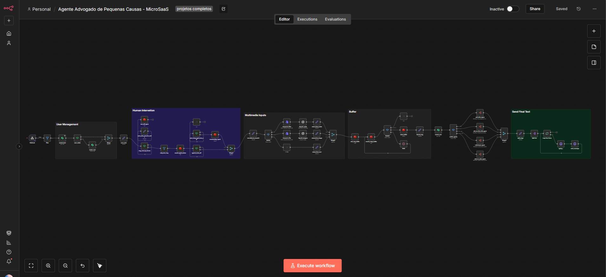
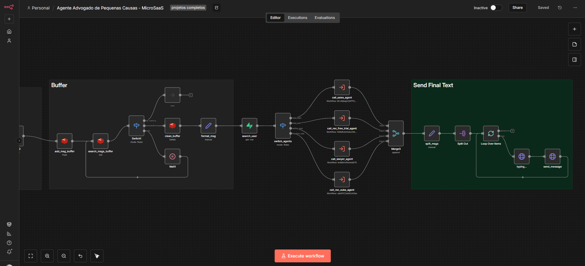

# ⚖️ AI Legal Assistant – Agente Jurídico com RAG e Automação

Sistema de automação inteligente voltado para atendimento jurídico, utilizando **IA + RAG + n8n**, capaz de interpretar dúvidas legais, consultar documentos e executar fluxos automatizados.

---

## 🚀 Visão Geral

Este projeto consiste em um **agente jurídico automatizado**, projetado para atuar como primeiro nível de atendimento, sendo capaz de:

- Interpretar dúvidas jurídicas com IA
- Consultar base de conhecimento (CDC) via RAG
- Direcionar fluxos (atendimento, qualificação, vendas)
- Automatizar interações e respostas
- Escalar atendimento sem aumentar equipe

💡 A proposta é transformar o atendimento jurídico em um processo **mais rápido, escalável e orientado a dados**.

---

## 🧠 Arquitetura da Solução

A solução foi estruturada em módulos independentes dentro do n8n, permitindo escalabilidade e manutenção facilitada:

- Entrada (Webhook) → Processamento → IA + RAG → Orquestração de Agentes → Resposta ao usuário

---

## ⚙️ Stack Tecnológica

### 🔗 Automação
- n8n (orquestração de workflows)

### 🤖 Inteligência Artificial
- OpenAI (interpretação e geração de respostas)

### 📚 RAG (Retrieval-Augmented Generation)
- Base de conhecimento com documentos jurídicos (CDC)
- Embeddings para busca semântica
- Recuperação de contexto relevante

### 🗄️ Dados e Memória
- Supabase / PostgreSQL
- Redis (buffer e controle de mensagens)

### 🔌 Integrações
- APIs REST
- Webhooks
- Serviços externos (ex: pagamentos, CRM)

### 🐳 Infraestrutura
- Docker
- Portainer
- VPS (Hetzner)
- Cloudflare

---

## 🔄 Funcionalidades Principais

- ✔️ Atendimento jurídico automatizado
- ✔️ Interpretação de dúvidas com IA
- ✔️ Consulta inteligente via RAG (CDC)
- ✔️ Roteamento para múltiplos agentes (ex: vendas, suporte, qualificação)
- ✔️ Buffer de mensagens (controle de entrada)
- ✔️ Processamento de texto e áudio
- ✔️ Respostas estruturadas e dinâmicas

---

## 🧩 Componentes do Sistema

### 🧑‍⚖️ Agente Jurídico (Core)
Responsável por interpretar a intenção do usuário e gerar respostas baseadas em contexto jurídico.

### 🧠 RAG (Base de Conhecimento)
- Documentos segmentados (chunking)
- Busca semântica via embeddings
- Retorno de contexto relevante para o LLM

### 🔀 Orquestração de Agentes
Sistema que direciona o fluxo para diferentes agentes dependendo da intenção:
- Atendimento jurídico
- Vendas
- Qualificação
- Suporte

### 📥 Buffer de Mensagens
Evita processamento duplicado e organiza o fluxo de entrada do usuário.

---

## 🛠️ Fluxo da Automação

1. Usuário envia mensagem (texto ou áudio)
2. Sistema normaliza e processa entrada
3. Buffer organiza mensagens recebidas
4. IA identifica intenção do usuário
5. Sistema consulta base RAG (quando necessário)
6. Workflow direciona para agente correto
7. Resposta é estruturada e enviada ao usuário

---

## 📊 Demonstração

### 🔄 Visão geral do workflow

---

### 🧠 Orquestração e envio de respostas

💡 Destaques do fluxo:
- Separação por módulos (User, Buffer, IA, Output)
- Uso de múltiplos agentes especializados
- Controle de mensagens e estado
- Pipeline de resposta estruturado

---

## 🧩 Desafios Técnicos Resolvidos

- 🔻 Estruturação de RAG para contexto jurídico
- 🔻 Segmentação eficiente de documentos (chunking)
- 🔻 Controle de fluxo com múltiplos agentes
- 🔻 Tratamento de mensagens concorrentes (buffer)
- 🔻 Integração entre IA + automação + APIs

---

## 📈 Possíveis Evoluções

- Dashboard de analytics jurídico
- Integração com CRM jurídico
- Sistema de geração automática de documentos
- Fine-tuning ou ajuste de prompts jurídicos
- Multi-idioma

---

## 🚀 Sobre o Projeto

Este projeto demonstra na prática como combinar:

- IA + Automação
- RAG + dados estruturados
- Integrações entre sistemas

Para criar soluções escaláveis em contextos reais.

---

## 👨‍💻 Autor

Pedro Lisboa

- 💼 Automação | IA | n8n | APIs
- 🔗 LinkedIn: https://www.linkedin.com/in/pedrolisboacc/

---

## 📬 Contato

📧 pedroliscosmo27@gmail.com

---

## ⭐ Observação

Projeto desenvolvido com foco em aplicação real de IA em processos jurídicos, demonstrando como automatizar atendimento especializado com eficiência e escala.
